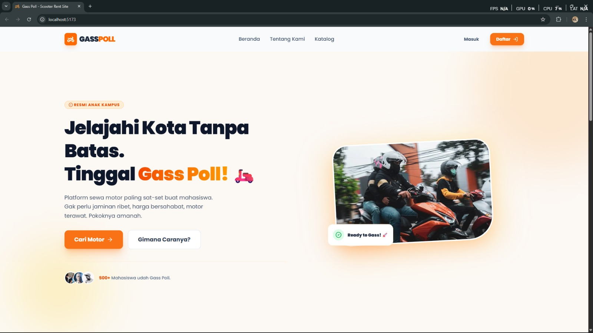
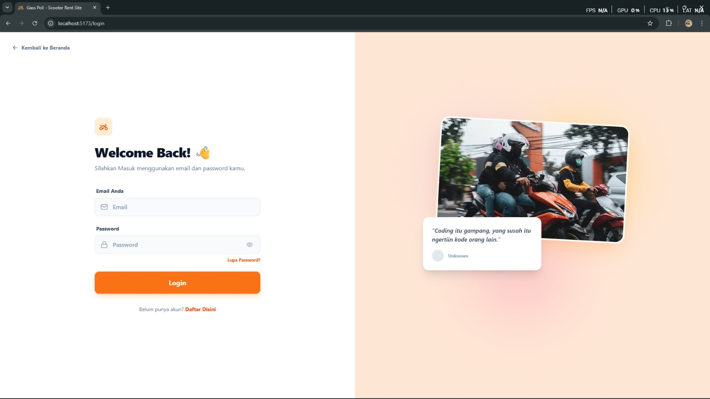
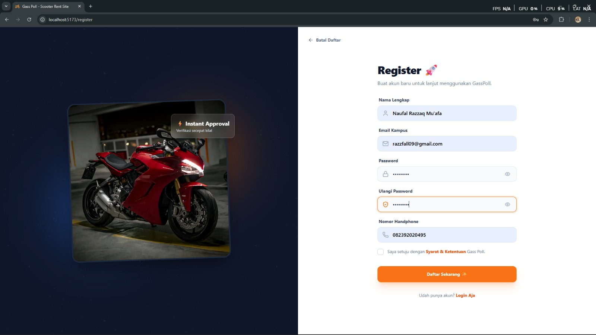
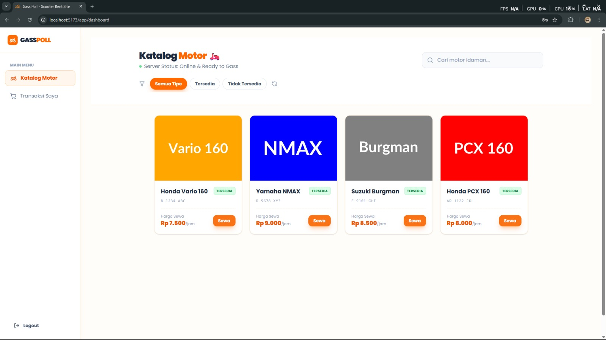
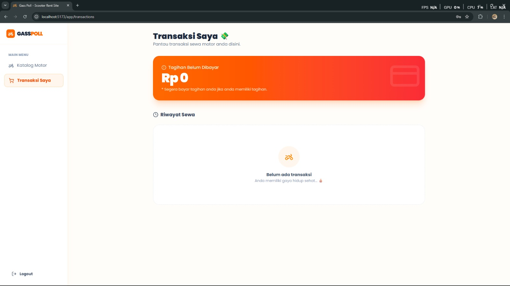
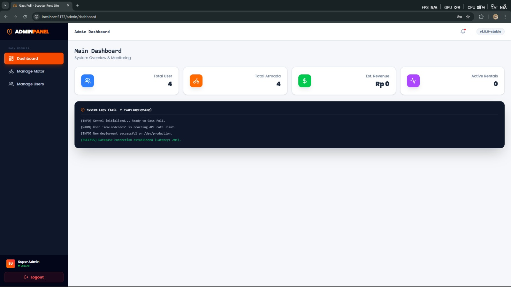
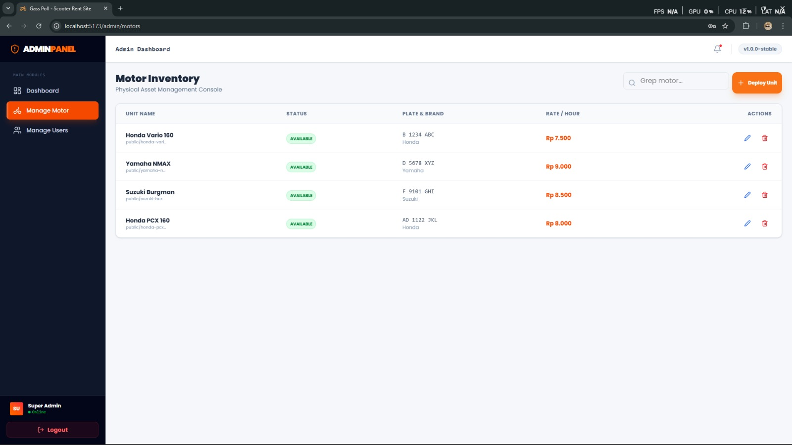
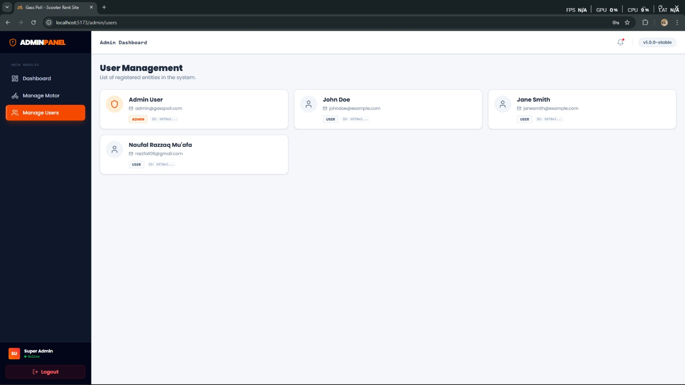

# 🛵 GASS-POLL - Scooter Rent Site

  
  
  
  

 

> **"Coding itu gampang, yang susah itu ngertiin kode orang lain."**
> — _Quote Legend di Halaman Login GASS-POLL._

**GASS-POLL** adalah platform penyewaan motor paling _sat-set_ yang didesain dengan tampilan futuristik dan fungsional. Sistem ini memisahkan kasta akses menjadi dua: **Admin Panel** untuk kontrol penuh armada, dan **User Interface** untuk kemudahan peminjaman.

---

## ⚡ Fitur Utama (Core Features)

### 👑 Kasta Admin (The Garage Master)

Tempat kendali utama buat sang pemilik armada:

- **System Monitoring:** Cek jumlah user, total armada, dan perputaran uang secara real-time.
- **System Logs:** Pantau kesehatan database dan log aktivitas server langsung dari dashboard.
- **Inventory Control:** Update status motor (`Available`/`Unavailable`), ubah harga sewa, atau tambah stok motor baru.
- **User Management:** Monitoring database mahasiswa yang sudah terdaftar dalam sistem.

### 👤 Kasta User (The Campus Rider)

Didesain buat kenyamanan mobilitas harian:

- **Instant Registration:** Daftar akun secepat kilat dengan fitur _Instant Approval_.
- **Smart Catalog:** Pilih motor idaman (Vario 160, NMAX, PCX) dengan status ketersediaan yang riil.
- **Personal Dashboard:** Pantau tagihan aktif dan riwayat sewa agar tetap disiplin bertransaksi.

---

## 📸 Penampakan Visual (Showcase)

### 🚀 Access & Landing Page

Gerbang utama masuk ke ekosistem GASSPOL:

  
  
<i>Landing Page: Visual yang bersih dan futuristik.</i>

  
  
  
<i>Akses Masuk & Registrasi: Simple dan aman.</i>

---

### 🛵 User Experience

Katalog motor dan sistem pemantauan tagihan:

  
  
  
<i>Katalog Motor Ready & Dashboard Transaksi User.</i>

---

### 🛠️ Admin Authority

Pusat komando manajemen sistem GASSPOL:

  
  
<i>Monitoring Dashboard: Pantau statistik dan System Logs.</i>

  
  
  
<i>Manajemen Stok Motor & Database Pengguna.</i>

---

## 🛠️ Jeroan Mesin (Tech Stack)

- **Frontend:** `React` + `Vite` + `TypeScript`.
- **Runtime:** `Bun` (Package manager & runtime super cepat).
- **Backend:** `Python` (`Flask`) dengan bantuan `uv` package manager.
- **Database:** `MongoDB` (`Pymongo`) untuk manajemen data fleksibel.

---

## 👤 Contributor

- M.Faridh Maulana {Frontend-Developer}
- Naufal Razzaq Muafa {Backend-Developer}
- Muhammad Dafi Al Haq {Documentator}
